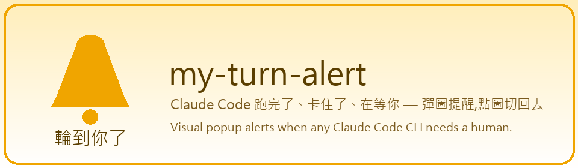
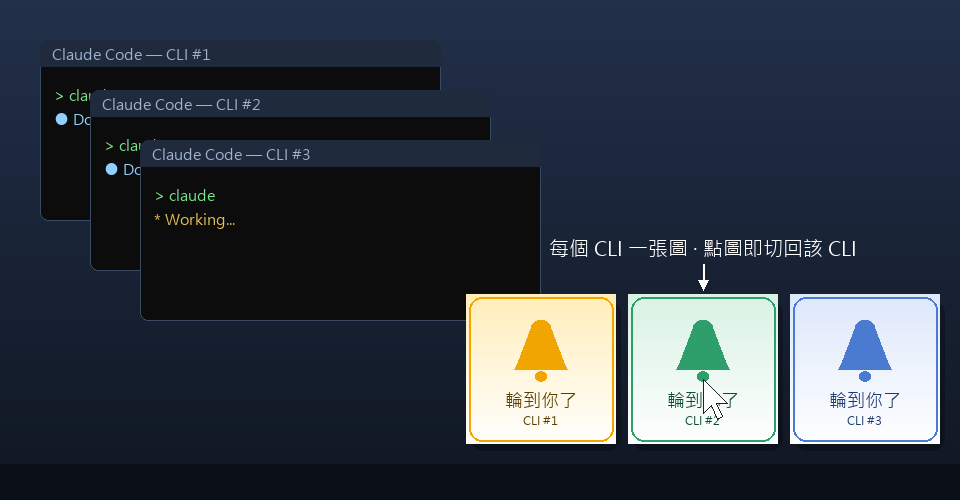

<div align="center">



# my-turn-alert

**Claude Code finished, got stuck, or is waiting for you — a popup image alerts you. Click it to jump right back.**

*Visual popup alerts when any Claude Code CLI needs a human. Click the image to jump back to that CLI.*

[](./.claude-plugin/plugin.json)
[](./LICENSE)
[](#platform-support)
[](https://code.claude.com/docs/en/plugins)

**English** · [繁體中文](./README.zh-TW.md)

[Install](#-installation) · [Features](#-features) · [Custom Images](#%EF%B8%8F-custom-images) · [Configuration](#%EF%B8%8F-advanced-configuration) · [Troubleshooting](#-troubleshooting) · [How It Works](#-how-it-works)

</div>

---

## What is this?

If you often run **several Claude Code CLIs at once** and keep missing the moment one of them finishes and it's your turn — this plugin is for you.

It listens to Claude Code's **Stop / StopFailure / Notification** events. Whenever any CLI finishes a response, hits an API error, asks for permission, or sits idle waiting for input, a **per-CLI image** pops up in the bottom-right corner of your screen to pull your attention back. **Click the image to bring that CLI's window straight to the foreground.**



## ✨ Features

| | Feature | Description |
| --- | --- | --- |
| 🔔 | **Popup when it's your turn** | Response finished, API error, permission request, idle waiting — covers every "human's turn" moment |
| 🖱️ | **Click to jump back** | Click any image and the matching CLI window comes to the foreground; that image closes (others stay) |
| 🧠 | **Auto-dismiss on return** | Precise window-handle matching: switch back to that CLI and its popup closes by itself |
| 🗂️ | **One image per session** | Run N Claude Codes at once — each session is permanently bound to its own image, so you can tell at a glance who's calling |
| 📐 | **Adaptive grid** | 1–3 in a row, 4 as 2×2, more wrap and scale automatically; never cropped, never off-screen |
| 🖼️ | **Zero-config custom images** | Drop images into `user-images/` and they just work — **always used first**; auto-generated numbered images only fill the overflow |
| 🔇 | **Never interrupts you** | Popups don't steal focus or break your typing; repeated triggers from the same CLI overwrite instead of stacking; event echoes within ~2 minutes of dismissal don't re-pop |
| 🛡️ | **Clear security boundary** | Only reads/writes its own state folder; never touches the registry, PATH, startup entries, or global keyboard hooks ([see Security](#%EF%B8%8F-security-boundary)) |
| 💨 | **Doesn't slow Claude down** | Hooks return within a few hundred milliseconds; a long-lived renderer draws in the background and exits once all popups are closed |

## 📦 Installation

Type these three lines in Claude Code, in order:

```text
/plugin marketplace add my-turn-alert/my-turn-alert
/plugin install my-turn-alert@my-turn-alert
/plugin enable my-turn-alert@my-turn-alert
```

> ⚠️ **Don't skip step three**: plugins are **disabled by default** after installation. Hooks only take effect after `enable` (or `/reload-plugins`, or a new session). If nothing happens after installing, this step is the culprit nine times out of ten.

Once installed, the next time Claude finishes a response an alert image pops up in the bottom-right corner:

<div align="center">


</div>

### Platform support

| Platform | Support level | Requirements |
| --- | --- | --- |
| **Windows** | ✅ Full (click-to-switch, auto-dismiss on return) | Git Bash (bundled with Claude Code) + PowerShell |
| **macOS** | 🟡 Best-effort (can bring the terminal app forward, cannot target a specific tab) | `python3` + Tkinter |

### Update / disable / uninstall

```text
/plugin marketplace update my-turn-alert   # update to the latest version
/plugin disable my-turn-alert@my-turn-alert   # temporarily turn off
/plugin uninstall my-turn-alert@my-turn-alert # remove
```

## 🎯 When does it trigger?

By default it listens to the following events, covering every moment when "the AI isn't running — it's your turn or needs your attention":

| Event | When it pops |
| --- | --- |
| **Stop** | Every time Claude finishes a response, after a plain-text question, before waiting for input |
| **StopFailure** | API errors: HTTP 400 (invalid_request), 429 (rate_limit), 5xx (server_error), overloaded, billing_error, max_output_tokens (context overflow), etc. |
| **Notification** (`permission_prompt`) | Claude asks you to authorize a tool |
| **Notification** (`idle_prompt`) | Claude is idle waiting for your input |
| **Notification** (`elicitation_dialog`) | An MCP tool requests structured input mid-run |

`SubagentStop` is **not** monitored (the main loop is still running when a subagent finishes — not a "human's turn" moment).

These settings live in [`hooks/hooks.json`](./hooks/hooks.json); edit it to change the trigger events.

## 🖼️ Custom Images

**Zero configuration — drop images in and they work.** Put your images (PNG recommended) into the **dedicated user folder**:

| OS | Path |
| --- | --- |
| Windows | `%USERPROFILE%\.claude\alert-need-human\user-images\` |
| macOS | `~/.claude/alert-need-human/user-images/` |

(Created automatically on first trigger; `~/.claude/alert-images/` also works — both folders are merged.)

**Your images always come first** (v1.5.0): each Claude Code session claims one of your images in filename order (case-insensitive) and is **permanently bound** to it — the same session keeps the same image regardless of windows or completion order. Only after all your images are taken do **overflow sessions fall back to auto-generated numbered images**; the next cycle returns to your images first.

**Image source priority** (highest to lowest, each level a fallback):

1. **User images** (`user-images/` + `~/.claude/alert-images/` merged) → one image bound per session
2. **User images all taken (or none) → auto-generated numbered images 001..100** (written to `~/.claude/alert-need-human/auto-images/`, **your images are never touched**; disable with `ALERT_DISABLE_AUTOGEN=1`)
3. Legacy single image `~/.claude/alert-image.png` exists → all CLIs share it (backward compatible)
4. None of the above → built-in default image `assets/default-alert.png`
5. Even the built-in image is missing → the renderer draws a yellow "load failed" placeholder with a red border (**never a blank window**)

> 💡 If you previously dropped your own images into `auto-images/`, no need to move them: on the next trigger the plugin automatically migrates non-numbered image files to `user-images/`, keeping existing bindings intact.

> 💡 **PNG recommended**: Tkinter on macOS only accepts PNG / GIF; Windows supports PNG / JPG / GIF / BMP. Use PNG for cross-platform consistency.

## 🧹 When do popups disappear?

- **Click the image** → closes immediately and brings the matching CLI window to the foreground.
- **Switch back to the matching CLI** (matched precisely by window hwnd, not by global process name):
  - You were **not** in that CLI when the popup appeared → switching back to it auto-closes the popup.
  - You were **already** in that CLI when the popup appeared → it takes **one more click or keypress** in that window to close; with no input activity the image stays and waits for you.
- **Minimum display time of 1.5 s** — never closes sooner, avoiding a blink-and-miss flash.
- Clicking one image only closes that one; other CLIs' images stay up.
- Repeated triggers from the same CLI overwrite its own image — no stacking.
- **At most 100 at once** (`ALERT_MAX_POPUPS`): first come, first served; once full, new CLIs don't pop until old images close and free up slots.

## ⚙️ Advanced Configuration

### Grid size, position, spacing

Defaults live at the top of the popup scripts (`scripts/show-popup.ps1` and `show-popup.sh`); edit them as you like:

| Item | Default | Variable (Windows / macOS) | Description |
| --- | --- | --- | --- |
| Max per row | 3 | `$MaxPerRow` / `MAX_PER_ROW` | Wraps into a grid beyond this |
| Layout width ratio | 0.40 | `$MaxLayoutWidthRatio` / `MAX_LAYOUT_WIDTH_RATIO` | Cap on total layout width ÷ screen width |
| Max cell size | 320 px | `$CellMaxPx` / `CELL_MAX` (env `ALERT_CELL_MAX`) | Cap on a single image's size — keeps 1–3 popups small in the corner |
| Cell gap | 12 px | `$GapPx` / `GAP` | Whitespace between images |
| Corner margin | 20 px | `$MarginPx` / `MARGIN` | Distance from the bottom-right screen corner |
| Poll interval | 300 ms | `$PollMs` / `POLL_MS` | How often the renderer scans the state folder and foreground window |

**Adaptive grid rules**: 1/2/3 images in one row → 4 as 2×2 → 5/6 as 3×2 → beyond that wraps with `cols = min(total, MaxPerRow)`. Each image scales proportionally without cropping; total height never exceeds the screen work area.

**Multi-monitor**: by default popups show in the bottom-right of the screen where the most recent alert's CLI lives; set `ALERT_MONITOR=N` (1-based) to pin them to monitor N (Windows; out-of-range falls back to the default behavior).

### Environment variables

| Variable | Default | Purpose |
| --- | --- | --- |
| `ALERT_STATE_DIR` | `~/.claude/alert-need-human` | State folder (for tests/sandboxing) |
| `ALERT_IMAGE_DIR` | `~/.claude/alert-images` | External user asset folder (merged with `user-images/`; read-only) |
| `ALERT_MAX_POPUPS` | `100` | Max popups visible at once (first come, first served; new CLIs wait once full) |
| `ALERT_MONITOR` | auto | Pin popups to monitor N (1-based); unset or out-of-range uses the most recent alert's CLI screen |
| `ALERT_CELL_MAX` | `320` | Max size (px) of a single popup image; raise it if you want bigger images |
| `ALERT_DISABLE_AUTOGEN` | `0` | Set `1` to disable auto-generating 001..100 when the image folder is empty |
| `ALERT_DEFAULT_IMAGE` | plugin built-in | Final fallback image when every other source fails |
| `ALERT_LOCK_STALE_SECS` | `30` | Lock directories older than this are treated as orphans (left by killed hooks) and broken automatically |
| `ALERT_WINCAP_TIMEOUT` | `6` | Timeout in seconds for the PowerShell call that captures the terminal window; on timeout degrades to hwnd=0 |

## 🪟 Window binding & the probe (Windows)

**"Click to jump back to the right CLI" relies on binding the terminal window handle.** Windows Terminal, PowerShell, cmd, the VS Code integrated terminal and more are recognized by default (the list is `$termNames` at the top of `scripts/get-window.ps1`).

**If clicking doesn't switch to the right CLI (or doesn't switch at all):**

1. Run the diagnostic probe from the terminal where you actually run Claude Code:
   ```powershell
   powershell -ExecutionPolicy Bypass -File "path-to-scripts/scripts/probe-window.ps1"
   ```
   ("path-to-scripts" = the plugin install directory, usually under `~/.claude/plugins/...`)
2. The probe dumps the terminal process tree and window info to `~/.claude/alert-need-human/probe.txt`.
3. Open that file, find your terminal's process name (e.g. `Tabby.exe` / `Hyper.exe` / `Cmder.exe`), and add it to the `$termNames` array at the top of `scripts/get-window.ps1`.
4. The next popup will switch correctly.

**macOS limitation**: "click to jump to the exact tab" is best-effort — it may only be able to bring the terminal app to the front (cannot identify a specific tab).

## 🩺 Troubleshooting

| Symptom | Likely cause & fix |
| --- | --- |
| Nothing happens after installing | You forgot `/plugin enable ...` or `/reload-plugins` (see installation step three) |
| No popup on Windows | Requires Git Bash (Claude Code uses it for hooks on Windows by default); PowerShell must be runnable (this plugin already uses `-ExecutionPolicy Bypass`) |
| No popup on macOS | Requires a working `python3` + Tkinter; without Tkinter the renderer exits silently. Install python3-tk |
| Click switches to the wrong CLI | Run `probe-window.ps1` once (see section above) and add your terminal's process name to the list |
| Can't switch to the right tab on macOS | Known limitation — can only bring the terminal app to the front |
| Want to turn it off temporarily | `/plugin disable my-turn-alert@my-turn-alert` |
| Used to pop, gradually stopped | Orphan-lock issue before v1.4.0; v1.4.1+ self-heals by breaking stale locks. Manual fix: delete the `*.lock` directories under `~/.claude/alert-need-human/` |
| Popup interrupts your typing | Shouldn't happen (popups never steal focus); if it still does, please open an issue with your terminal type and environment |

## 🧩 How It Works

```
Event (Stop / StopFailure / Notification: permission|idle|elicitation)
  └─ triggered via hooks/hooks.json
       └─ bash scripts/alert.sh   ← thin "writer": writes state + ensures renderer is running, returns immediately
            ├─ reads stdin JSON (session_id, cwd)
            ├─ captures this CLI's terminal window handle + terminal pid
            ├─ assigns this CLI an image via the "seat-claiming" rule
            ├─ writes ~/.claude/alert-need-human/pending/<key>.txt
            └─ grabs renderer.lock → starts renderer in background if not running → releases lock
                 └─ long-lived renderer (Windows: PowerShell+WinForms / macOS: Python+Tkinter)
                      ├─ polls pending/: added → join grid & re-layout; removed → drop & re-layout; empty → exit
                      ├─ foreground window == some popup's hwnd → close that popup
                      └─ click a popup → SetForegroundWindow(its hwnd) + close that popup
```

The popup starts in the background; `alert.sh` returns within a few hundred milliseconds and **never blocks Claude's** next step.

**State folder** `~/.claude/alert-need-human/` (shared across sessions; never inside project directories):

```
~/.claude/alert-need-human/
├── pending/<key>.txt     ← one pending alert (keyed by terminal pid)
├── renderer.pid          ← PID of the long-lived renderer (single instance)
├── renderer.lock         ← startup mutex
├── assignments.tsv       ← session_id → image-path seat assignments (permanent binding)
├── user-images/          ← your images go here (always used first)
├── auto-images/          ← auto-generated numbered images (overflow only)
└── seq                   ← global monotonic sequence (determines grid ordering)
```

**Self-healing**: on every poll, if a pending file's terminal pid no longer exists (CLI closed) the renderer deletes that file, preventing orphan popups; when `pending/` is empty the renderer exits.

### Directory layout

```
my-turn-alert/
├── .claude-plugin/
│   ├── plugin.json          # plugin identity
│   └── marketplace.json     # install source definition
├── hooks/
│   └── hooks.json           # Stop / StopFailure / Notification hooks → alert.sh
├── scripts/
│   ├── alert.sh             # cross-platform dispatcher: detect OS, write state, start renderer
│   ├── popup-common.sh      # shared functions: image discovery, seat assignment, file locks
│   ├── show-popup.ps1       # Windows renderer (PowerShell + WinForms grid)
│   ├── show-popup.sh        # macOS renderer (Python + Tkinter grid)
│   ├── get-window.ps1       # Windows terminal window resolution (incl. ConPTY delegation)
│   ├── probe-window.ps1     # Windows window-binding diagnostic probe
│   └── lib/                 # auto-generated numbered images, grid math
├── assets/                  # built-in default image & README images
├── tests/                   # tests (bash / PowerShell / Python)
└── docs/SPEC.md             # full design spec
```

## 🛡️ Security Boundary

This plugin strictly reads/writes only the locations below; **it never touches any other system setting**:

| Location | Read | Write | Purpose |
| --- | --- | --- | --- |
| `~/.claude/alert-need-human/` (state) | ✅ | ✅ | pending, seat assignments, sequence, renderer.pid, locks, user-images/, auto-images/ |
| `~/.claude/alert-images/` (external user assets) | ✅ | ❌ | Your images — treated as read-only by this plugin |
| Plugin install directory | ✅ (scripts) | ❌ (runtime) | Only written by Claude Code during install/update |

**Never touched**: registry, PATH, `~/.bashrc`/`~/.zshrc`/profile.ps1, startup entries, Scheduled Tasks, Windows services, global keyboard/mouse hooks (`SetWindowsHookEx` is never used; `GetLastInputInfo` is a passive read-only API), other users' directories.

Defensive measures: every key read from JSON/stdin/files passes the whitelist `[A-Za-z0-9_.-]{1,128}`; atomic writes realpath-validate to reject `..` path escapes; PID matching is regex-escaped against injection; the renderer re-validates filename/content consistency.

For detailed data flow, the popup close state machine and security analysis, see [`docs/SPEC.md`](./docs/SPEC.md).

## 🧪 Tests

```bash
bash tests/run-tests.sh
```

Coverage: state folder & atomic writes, image seat assignment & cycling, end-to-end pending content, path conversion, cap gating & regex-injection defenses, idempotent auto-generation, cross-platform grid-math consistency (see the test matrix in [`docs/SPEC.md`](./docs/SPEC.md)).

## License

[MIT](./LICENSE)
